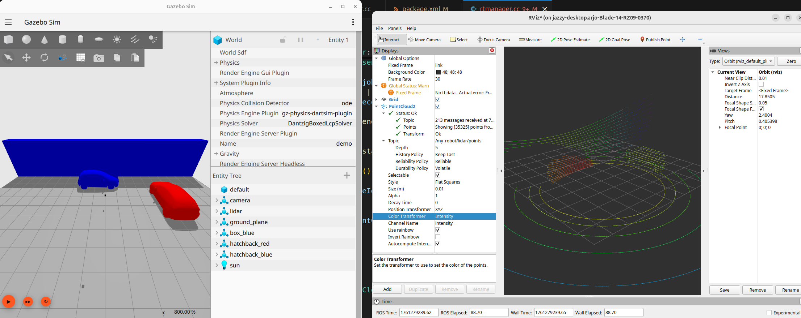

# WGPU_RT_LIDAR

This project is a high-performance, hardware-accelerated ray tracing library for robotics and autonomy simulation, written in Rust and using the `wgpu` graphics API. It provides a flexible and easy-to-use platform for simulating sensor data from LiDAR and depth cameras in 3D environments.

Here you can see it being used as a LiDAR backend in Gazebo:


At its core, the library provides a `RayTraceScene` that can be populated with 3D mesh assets and instances. It leverages hardware-accelerated ray tracing through `wgpu`'s support for acceleration structures (BLAS and TLAS), enabling efficient rendering of complex, dynamic scenes.

The library offers two main sensor simulation modules:

*   **LiDAR:** The LiDAR module allows for the creation of custom LiDAR sensors with arbitrary beam patterns. It can simulate both the raw beam returns (distances) and generate 3D point clouds.
*   **Depth Camera:** The depth camera module simulates a pinhole camera model to generate depth images and point clouds from the scene.

Key features of the library include:

*   **Hardware-Accelerated Ray Tracing:** Utilizes the `wgpu` API for high-performance ray tracing on modern GPUs.
*   **Dynamic Scenes:** Supports dynamic scenes where objects can be added, removed, or moved at runtime.
*   **Flexible Sensor Models:** Provides flexible and configurable models for both LiDAR and depth cameras.
*   **Point Cloud Generation:** Can generate both depth images and 3D point clouds from the simulated sensors.
*   **Visualization:** Integrates with the `rerun` visualization library for easy debugging and visualization of scenes and sensor data (optional feature).
*   **Asynchronous API:** The library is designed with an asynchronous API, allowing for efficient integration into larger applications.

The project includes examples that demonstrate how to create a scene, configure and use the sensor models, and visualize the results. This library is an ideal tool for researchers and engineers working on robotics, autonomous driving, and other applications that require realistic sensor simulation.

## Usage

To use this library in your project, add it to your `Cargo.toml`:

```toml
[dependencies]
wgpu_rt_lidar = "0.1"
```

### Visualization Feature

The library includes optional visualization support via the `rerun` library. To enable visualization features, add the `visualization` feature to your dependency:

```toml
[dependencies]
wgpu_rt_lidar = { version = "0.1", features = ["visualization"] }
```

With the `visualization` feature enabled, you can use the `visualize()` method on `RayTraceScene` and the `visualize_rays()` method on `Lidar` to visualize scenes and sensor data using `rerun`.

## Bindings

This project only offers a rust crate that renders LiDAR and Depth Cameras, however we provide bindings to other simulators:
* [Gazebo Binding](https://github.com/arjo129/gz_wgpu_rt_lidar)

I would love to see more bindings such asones for bevy or even a python wrapper around this library.

## Future improvements

Currently this relies on a seperate GPU call per sensor. It should be possible to Batch multiple sensor calls from the same scene. 
However, there will need to be some work done to perform kernel fusion.
